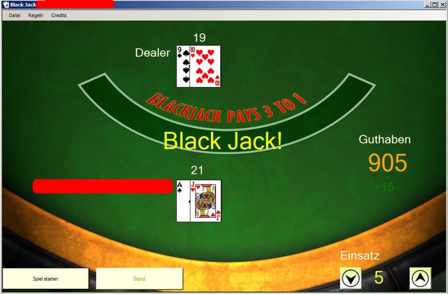

# Interim work Black Jack

This was an interim work in the study for electrical engineer HF in 2014 in computer science.
We had the task to program a simple Black Jack game. We had so much fun programming that we put a lot of effort into it. Unfortunately, the time was not enough to finish the program properly, so it is functional but with no features.

To play the game you need Visual Studio.
